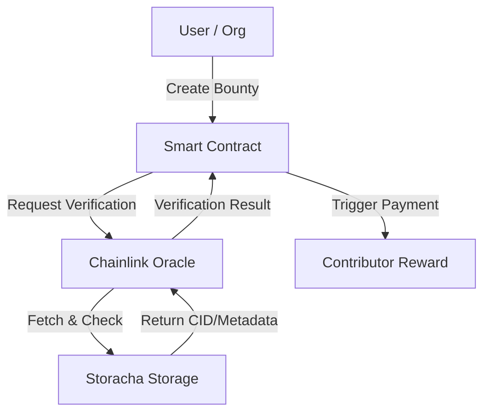

#  Chainlink + Storacha Data Marketplace

A decentralized system where bounties incentivize contributors to upload verified datasets into Storacha storage, with verification and payouts managed by smart contracts and Chainlink oracles.

---

#  Architectural Plan

## 1.1 High-Level Components

### Users / Data Contributors
- Post bounties for specific data.  
- Upload data to Storacha.  
- Receive rewards upon verification.  

### Smart Contracts
- Bounty management (create, track, payout).  
- Verification status (data received, verified, payout triggered).  
- Payment mechanism (ETH or ERC20 tokens).  

### Storacha Decentralized Storage
- Stores contributed data permanently and immutably.  
- Provides a CID or metadata tag for referencing.  

### Chainlink Oracles
- Acts as the bridge between smart contracts and off-chain data.  
- Verifies data existence/content on Storacha.  
- Returns results to smart contracts (success/failure).  

### Off-chain External Adapters (Optional)
- Fetch data from Storacha for additional verification.  
- Validate metadata, timestamps, and hashes for integrity.  

###  Frontend / User Interface
- Web3-enabled dApp.  
- Users can create bounties, upload files, view status, and claim rewards.  

## 1.2 Data Flow Diagram

## 1.3 Key Smart Contract Modules

### BountyManager
- Create bounty with details (type of data, reward, deadline).  
- Track contributions.  

### DataRegistry
- Store metadata: CID, contributor address, timestamp.  
- Map bounties to data entries.  

### OracleInteraction
- Trigger Chainlink oracle calls.  
- Store oracle verification results.  

### PaymentModule
- Release funds upon verified data.  
- Handle partial payments or penalties for invalid/missing data.  

---

## 1.4 Chainlink Integration

**Functions or External Adapters:**
- **Input:** Bounty ID, CID/metadata.  
- **Output:** Verification status (bool or hash match).  
- **Triggers:** `fulfillOracleRequest()` in smart contract.  

**Security Considerations:**
- Use multiple oracles or aggregated verification to prevent single-point failures.  
- Optionally add a “challenge period” for bounty disputes.  

